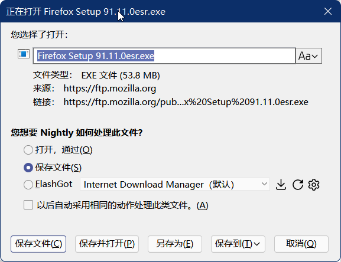

# downloadPlus.uc.js

Firefox下载增强工具，依赖 userChrome.js Loader

目前最新版为`downloadPlus_ff98.uc.js`

### 功能(Description)

- 默认选择下载文件
- 改名后保存
- 保存并打开
- 另存为
- 下载提示音
- 来源显示完整目录并支持双击复制完整地址
- 第三方工具下载（依赖 FlashGot）

### 说明(Usage)

`flashgot.exe`默认存放路径为

> ProfileDir\chrome\UserTools\FlashGot.exe

高级首选项（about:config）

>userChromeJS.DownloadPlus.enableRemoveFromDiskMenuitem 启用从硬盘删除右键菜单
>
>userChromeJS.downloadPlus.enableFlashgotIntergention 启用 Flashgot 集成
>
>userChromeJS.downloadPlus.flashgotPath Flashgot可执行文件路径
>
>userChromeJS.downloadPlus.flashgotManagers 下载器列表缓存（一般不需要修改)
>
>userChromeJS.downloadPlus.flashgotDefaultManager 默认第三方下载器（一般不需要修改）
>
>userChromeJS.downloadPlus.enableRename 下载对话框启用改名功能
>
>userChromeJS.downloadPlus.enableDoubleClickToCopyLink 下载对话框双击复制链接
>
>userChromeJS.downloadPlus.enableSaveAndOpen 下载对话框启用保存并打开
>
>userChromeJS.downloadPlus.enableSaveAs 下载对话框启用另存为
>
>userChromeJS.downloadPlus.enableSaveTo 下载对话框启用保存到
>
>userChromeJS.downloadPlus.enableDownloadNotice 启用下载通知音
>
>userChromeJS.downloadPlus.notice.DL_START 下载开始通知音路径
>
>userChromeJS.downloadPlus.notice.DL_DONE 下载成功通知音路径
>
>userChromeJS.downloadPlus.notice.DL_CANCEL 下载取消通知音
>
>userChromeJS.downloadPlus.notice.DL_FAILED 下载失败通知音路径

FlashGot.exe 支持调用哪些下载工具详见：[pouriap/Firefox-DownloadGrab: A Firefox addon that lets you download links with external download manager](https://github.com/pouriap/Firefox-DownloadGrab)

### 本地化(Localization)

修改脚本，大概37行开始

```
const LANG = {
```

### 截图(Sceenshot)



### 题外话(Off topic)

为什么文件名是`downloadPlus_ff98.uc.js`为什么叫这个名字？那是因为我从 Firefox 98 开始接手这个脚本的。

文件名没有要求，你想改成什么都可以。

### 感谢(Thanks)

[pouriap/Firefox-DownloadGrab: A Firefox addon that lets you download links with external download manager](https://github.com/pouriap/Firefox-DownloadGrab)