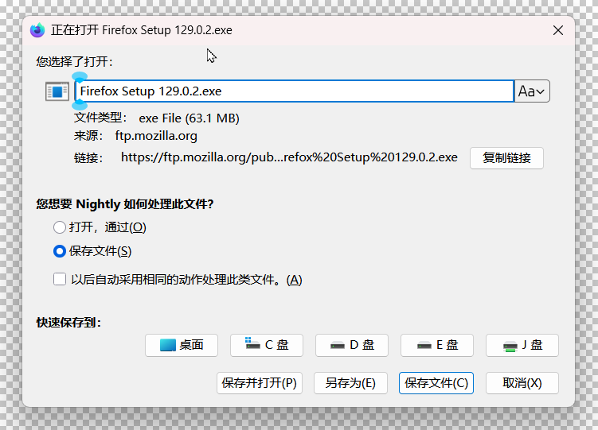

# downloadPlus.uc.js

**Firefox 下载增强工具**
_依赖 userChrome.js Loader_

目前最新版为 `downloadPlus_Fx136.uc.js`

---

### 功能

- 默认选择下载文件
- 改名后保存
- 保存并打开
- 另存为
- 下载提示音
- 显示完整目录并支持双击复制完整地址
- 第三方工具下载（支持 FlashGot 和 Aria2）

---

### 各个脚本

1. **downloadPlus_Fx136.uc.js** 不再解释
2. **downloadPlus_ff98.uc.js** 老版本，Firefox 136+ 无法使用
3. **downloadSoundPlay_Fx26.uc.js** 下载提示音独立脚本
4. **FlashGot.uc.js** FlashGot 联动功能独立脚本
5. **removeFileFromDownloadManager.uc.js** 右键菜单添加永久删除文件独立脚本

### 说明

**FlashGot.exe** 默认存放路径：

> ProfileDir\chrome\UserTools\FlashGot.exe

**Aria2c** 默认存放路径：

> ProfileDir\chrome\UserTools\Aria2\aria2c.exe

Aria2 ZIP 包包含 Aria2c 可执行文件，可从 [Releases](https://github.com/benzBrake/Firefox-downloadPlus.uc.js/releases) 下载。

#### 高级首选项（about:config）

- `userChromeJS.DownloadPlus.enableRemoveFromDiskMenuitem` — 启用从硬盘删除右键菜单
- `userChromeJS.downloadPlus.enableFlashgotIntegration` — 启用 FlashGot 集成
- `userChromeJS.downloadPlus.flashgotPath` — FlashGot 可执行文件路径
- `userChromeJS.downloadPlus.aria2Path` — Aria2c 可执行文件路径
- `userChromeJS.downloadPlus.enableAria2AutoStart` — 启动 Firefox 时自动启动 Aria2 RPC
- `userChromeJS.downloadPlus.enableAria2RpcSuccessAlert` — Aria2 RPC 添加任务成功时显示提示
- `userChromeJS.downloadPlus.aria2RpcUrl` — Aria2 RPC 地址（默认：http://127.0.0.1:6800/jsonrpc）
- `userChromeJS.downloadPlus.aria2RpcSecret` — Aria2 RPC 密钥
- `userChromeJS.downloadPlus.flashgotManagers` — 下载器列表缓存（一般不需要修改）
- `userChromeJS.downloadPlus.flashgotDefaultManager` — 默认第三方下载器（一般不需要修改）
- `userChromeJS.downloadPlus.enableRename` — 启用下载对话框改名功能
- `userChromeJS.downloadPlus.enableDoubleClickToCopyLink` — 下载对话框双击复制链接
- `userChromeJS.downloadPlus.enableSaveAndOpen` — 下载对话框启用保存并打开
- `userChromeJS.downloadPlus.enableSaveAs` — 下载对话框启用另存为
- `userChromeJS.downloadPlus.enableSaveTo` — 下载对话框启用保存到
- `userChromeJS.downloadPlus.enableDownloadNotice` — 启用下载通知音
- `userChromeJS.downloadPlus.notice.DL_START` — 下载开始通知音路径
- `userChromeJS.downloadPlus.notice.DL_DONE` — 下载成功通知音路径
- `userChromeJS.downloadPlus.notice.DL_CANCEL` — 下载取消通知音
- `userChromeJS.downloadPlus.notice.DL_FAILED` — 下载失败通知音路径

支持的下载工具：
- FlashGot 支持的工具列表见：[pouriap/Grabby](https://github.com/pouriap/Grabby)
- Aria2 CLI（命令行模式）
- Aria2 RPC（Web 接口模式，支持自动启动）

---

### 下载规则

```javascript
const DOWNLOAD_RULES = [
  {
    url: "匹配地址，支持 * 和 ? 或者以 ^ 开头的正则表达式",
    operate: "操作类型，支持 'save' / 'save-as' / 'flashgot' / 'aria2' / 'aria2-web'",
    size: "文件大小条件",
    saveTo: "保存到的路径，仅对 'save' 操作有效",
    manager: "下载工具名称，对 flashgot / aria2 / aria2-web 操作有用",
  },
];
```

#### 文件大小条件

格式：大小关键字 比较符号 大小

大小关键字支持 mb, kb, gb 比较符号支持`<`, `>`,`=`,` >=`,`<=`, `!=`，大小是数字

下面是几个示例

> mb > 100
>
> gb = 1
>
> kb < 100

### 如何下载 FlashGot.exe 和 Aria2

- **FlashGot.exe**: https://github.com/benzBrake/Firefox-downloadPlus.uc.js/releases/download/v2023.05.11/FlashGot.exe
- **Aria2.zip**: https://github.com/benzBrake/Firefox-downloadPlus.uc.js/releases（包含 aria2c.exe）

### 本地化(Localization)

修改脚本，大概 37 行开始

```
const LANG = {
```

### 截图(Sceenshot)



### 计划

[x] 制作独立版 FlashGot 脚本

[x] 从`downloadPlus_ff98.uc.js`中删除下载完成通知

[x] 永久删除文件功能独立成一个脚本

[x] 制作另存为功能的独立版

### 题外话(Off topic)

为什么文件名是`downloadPlus_ff98.uc.js`为什么叫这个名字？那是因为我从 Firefox 98 开始接手这个脚本的。

文件名没有要求，你想改成什么都可以。

### 感谢(Thanks)

[pouriap/Grabby: A browser extension for downloading files and media from websites](https://github.com/pouriap/Grabby)
